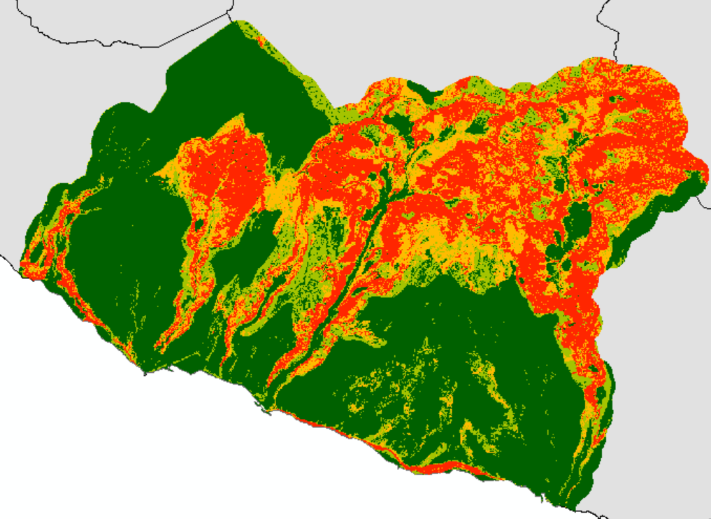

# AEAR
<B><i>Avaliação da suscetibilidade à ocorrência de deslizamentos no centro sul
da ilha da Madeira com a aplicação dos métodos do Valor Informativo
e Probabilidade Bayesiana</B> 

https://github.com/Norge0/AEAR

